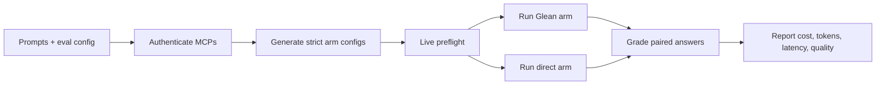

# Glean MCP A/B Evaluation Kit

A small, repeatable harness for comparing:

- **Glean MCP**: Claude Code connected to Glean MCP.
- **Direct MCPs**: Claude Code connected directly to the customer’s selected vendor MCPs.

The kit runs the same prompts with the same model, captures usage from Claude Code transcripts, checks MCP isolation, and produces paired quality/cost/latency results.

> **Current reference suite:** Glean MCP vs Slack + Atlassian + Notion + GitHub direct MCPs, using the 16-prompt pack in [`prompts/golden_prompts.reference.tsv`](prompts/golden_prompts.reference.tsv). The suite is included as a shareable reference; credentials, local MCP configs, and evaluation results remain local-only.

## Five-minute mental model



Each prompt runs in a fresh Claude Code session. The two arms are isolated with separate MCP JSON files, so a direct run cannot accidentally use Glean and a Glean run cannot accidentally use vendor MCPs.

## What the kit produces

For every prompt and arm:

- final answer text
- MCP servers and tools used
- input/output/cache/total tokens
- reported cost and latency
- model and retrieval validity signals

For each paired prompt:

- blind A/B judge scores for completeness, groundedness, and usefulness
- winner and judge reasoning
- watchouts and confidence

At the end:

- `results/aggregate_summary.md`
- `results/aggregate_rows.csv`
- optional `results/eval_submission.zip`

## Repository map

```text
scripts/glean_mcp_eval.py       Main CLI: setup, doctor, preflight, run, grade, report, package
config/                          Shareable example configs
prompts/                         Shareable example and reference prompt TSVs
mcp/                             Local strict MCP files; gitignored
config/server-profiles.example.json  Named direct-server profiles
results/                         Comprehensive local answers, grades, reports; customer data; gitignored
docs/END_USER_QUICKSTART.md     One-page guided setup
docs/END_USER_MCP_SETUP.md      Vendor authentication details
docs/METHODOLOGY.md              Evaluation design and validity rules
docs/FIELD_RUNBOOK.md            Facilitator/customer operating guide
commands/                       Claude Code plugin slash commands
.claude/skills/                  Project-local Claude Code skill
```

## Current supported workflow: Claude Code

Claude Code is the reference host because it supports:

- headless per-prompt sessions with `claude -p`
- strict per-arm MCP isolation
- read-only allowed/disallowed tool lists
- transcript-derived usage and cost
- structured judge output

Cursor support exists as a secondary adapter. The original Cursor Glean-MCP-vs-direct-MCP runbook is in [`docs/hosts/cursor.md`](docs/hosts/cursor.md); the separate Glean Cursor plugin comparison is in [`docs/hosts/cursor-glean-plugin.md`](docs/hosts/cursor-glean-plugin.md), with its [experiment brief](docs/CURSOR_GLEAN_PLUGIN_EXPERIMENT_BRIEF.md), [customer message](docs/CURSOR_GLEAN_PLUGIN_CUSTOMER_MESSAGE.md), [scoring sheet](docs/CURSOR_GLEAN_PLUGIN_SCORING_SHEET.md), and [readout template](docs/CURSOR_GLEAN_PLUGIN_READOUT_TEMPLATE.md).

## Quickstart for an operator

### 1. Prepare a local working copy

```bash
cd "/path/to/glean-mcp-ab-eval-kit"

python3 --version
claude --version
```

Use Python 3.11+ and a recent Claude Code CLI. Log Claude Code in once:

```bash
claude
```

Then run `/login` inside Claude Code.

### 2. Create local config files

For a new evaluation, use the guided setup command:

```bash
python3 scripts/glean_mcp_eval.py setup \
  --config eval.config.json \
  --profile current-reference
```

This creates local config, prompt, and MCP files when they do not exist and applies the selected direct-server profile. It does not overwrite existing local files unless you pass `--force`.

The equivalent manual setup is:

```bash
cp config/eval.config.strict.example.json eval.config.json
cp prompts/golden_prompts.reference.tsv golden_prompts.tsv
mkdir -p mcp
cp config/mcp.glean.example.json mcp/glean.mcp.json
cp config/mcp.direct.example.json mcp/direct.mcp.json
```

Edit `eval.config.json` to set:

- prompt file
- model and judge model
- participant ID at run time
- expected/forbidden servers for each arm
- read-only allowed/disallowed tools

The local files under `mcp/`, `eval.config.json`, `golden_prompts.tsv`, and `results/` are ignored by Git. The reference suite is the default for `setup`; teams can replace `golden_prompts.tsv` with their own prompt pack or use the smaller `prompts/golden_prompts.example.tsv` for a lightweight smoke run. Prompt TSVs may carry additional columns for optional metadata or future grading criteria, but the standard workflow only requires `ID`, `Dept`, and `Prompt`.

### 3. Authenticate MCPs

Authenticate the Glean MCP and the customer-selected direct MCPs in Claude Code. Use the vendor guide for exact URLs and OAuth/API-key details:

[docs/END_USER_MCP_SETUP.md](docs/END_USER_MCP_SETUP.md)

The current reference direct set is:

```text
slack
atlassian
notion
github
```

Check status:

```bash
claude mcp list
```

### 4. Materialize the strict direct config

Do not copy every ambient MCP into the eval. This command reads Claude Code’s local MCP definitions and selects only the names in `arms.direct.expected_mcp_servers`:

```bash
python3 scripts/glean_mcp_eval.py setup-direct \
  --config eval.config.json \
  --dry-run

python3 scripts/glean_mcp_eval.py setup-direct \
  --config eval.config.json
```

It writes `mcp/direct.mcp.json` and fails closed if an expected server is missing. It excludes unrelated servers such as `glean_default` and failed/stale entries.

### 5. Run the gates

Start with a cheap three-prompt smoke test:

```bash
python3 scripts/glean_mcp_eval.py smoke-test \
  --config eval.config.json \
  --participant-id smoke01
```

For the full gates:

```bash
python3 scripts/glean_mcp_eval.py doctor \
  --config eval.config.json

python3 scripts/glean_mcp_eval.py preflight \
  --config eval.config.json \
  --arm glean \
  --live

python3 scripts/glean_mcp_eval.py preflight \
  --config eval.config.json \
  --arm direct \
  --live
```

`run` refuses to start unless the latest live preflight passed. Preflight verifies that expected MCPs are available, forbidden MCPs are absent, and the probe actually retrieves from the required servers.

### 6. Run, grade, report, and package

The one-command path is:

```bash
python3 scripts/glean_mcp_eval.py run-all \
  --config eval.config.json \
  --participant-id mi01
```

`run-all` runs both arms, grades the paired answers, generates the report, and creates the checksum package. Existing successful prompt rows are skipped on later runs; use `--rerun-existing` when you intentionally want fresh answers.

The individual commands remain available for facilitator control:

```bash
python3 scripts/glean_mcp_eval.py run --config eval.config.json --arm glean --participant-id mi01
python3 scripts/glean_mcp_eval.py run --config eval.config.json --arm direct --participant-id mi01
python3 scripts/glean_mcp_eval.py grade --config eval.config.json --participant-id mi01
python3 scripts/glean_mcp_eval.py report --config eval.config.json
python3 scripts/glean_mcp_eval.py package --config eval.config.json
```

Run a subset for debugging:

```bash
python3 scripts/glean_mcp_eval.py run \
  --config eval.config.json \
  --arm direct \
  --participant-id debug01 \
  --prompt-ids ENG_001,CO_001
```

For a crossover pilot, vary the order across participants. The current reference run used Glean first and direct second; order is not encoded in the result validity logic.

### 7. Inspect outputs

`run-all` creates a comprehensive local record, report, and optional checksum package automatically. The important outputs include:

- `results/aggregate_summary.md`
- `results/aggregate_rows.csv`
- per-prompt answer, transcript, command, metadata, and `run.json` files
- `results/eval_submission.zip` when a packaged handoff is useful

Keep the complete results directory for auditability, but let the facilitator decide what to share with a customer. A customer-facing readout will usually use the aggregate summary, selected answer excerpts, and selected evidence—not raw transcripts or every internal artifact.

Do not make headline claims if `aggregate_summary.md` says `Run validity: FAIL` or quality grading is `NOT RUN`.

## The easiest path for a nontechnical end user

The recommended experience is to open the repo in Claude Code and ask Claude Code to act as the setup guide. The user selects the direct MCP profile and prompt pack, completes authentication and approvals, and chooses what to share. Claude Code runs the local setup, validation, smoke test, and evaluation commands, never requests secrets in chat, and preserves the comprehensive local artifacts.

Suggested first message:

```text
I want to run the Glean MCP A/B evaluation in this folder.

Read README.md and docs/END_USER_QUICKSTART.md first. Act as my setup guide and run the local setup commands on my behalf.

Before doing any setup, ask me which direct MCP profile I want: current-reference (Slack + Atlassian + Notion + GitHub), minimal (Slack + Atlassian), or a custom profile if available. Also ask which prompt pack I want: the 16-prompt reference suite, the smaller example suite, or a custom TSV path.

Show me the selected direct MCP profile and prompt pack, explain what will run, and wait for my explicit confirmation. Do not run setup, authentication checks, preflight, smoke tests, or evaluation prompts before I confirm those choices.

After confirmation, I will complete browser-based OAuth or other required authentication steps, provide approved Glean MCP connection details when needed, and approve the smoke test and full evaluation. Stop and explain any failure instead of asking me to run commands manually. Do not ask me to paste tokens, OAuth secrets, refresh tokens, or PATs into this chat.

Before the full evaluation, verify both arms with doctor and live preflight, then run the three-prompt smoke test. Only run the selected prompt pack after I approve the smoke-test result. Keep the evaluation strictly read-only, do not add ambient MCPs to either arm, keep all comprehensive artifacts local, and ask before sharing any result files or customer-facing excerpts.
```

This is easier for business power users and data analysts than memorizing the CLI. It still cannot eliminate vendor OAuth approval or credentials that only an administrator can provide.

## Make it frictionless: recommended product path

There are four practical levels of simplification:

| Audience | Recommended experience | Why |
|---|---|---|
| Technical evaluator | Current CLI workflow | Maximum control and auditability |
| Business power user / analyst | Open repo in Claude Code and use the guided setup prompt | Claude explains each step and handles the sequencing |
| Executive / customer sponsor | Facilitator runs the setup and evaluation, then shares the workbook/readout | Executives should not debug OAuth or terminal state |

### Included in this version

1. **Guided setup:** `setup` creates local files and applies a named direct-server profile.
2. **One-command execution:** `run-all` runs both arms, grades, reports, and packages.
3. **Resumability:** successful prompt rows are skipped unless `--rerun-existing` is supplied.
4. **Cheap validation:** `smoke-test` runs a three-prompt read-only check before the full evaluation.
5. **Server profiles:** `config/server-profiles.example.json` provides named direct-server sets.
6. **Facilitator-first operation:** [END_USER_QUICKSTART.md](docs/END_USER_QUICKSTART.md) separates operator setup from the executive/customer review experience.
7. **Keep secrets out of chat and Git.** Use vendor-native browser OAuth where possible, prompt for API keys in the terminal, and write only ignored local config.
8. **Make customer operation facilitator-first.** For external pilots, a trained facilitator should own MCP authentication and give the participant only the prompt/run experience.

### What we should not rely on

- Claude Desktop Connectors as an import source: the newer Connector state is not exposed to `claude mcp add-from-claude-desktop`.
- Reverse-engineering Claude Desktop keychains or caches: it is brittle and unsafe.
- Ambient MCP mode for benchmark runs: unrelated servers can leak into an arm and invalidate the comparison.
- Asking users to paste OAuth secrets or PATs into an LLM conversation.

## Evaluation design and safety

- Same prompt set and model across arms.
- Fresh Claude Code session per prompt.
- Strict per-arm MCP config.
- Read-only tool allowlist; mutation and arbitrary-dispatch tools are denied.
- Static and live preflight before running.
- Transcript-derived usage rather than estimated usage.
- Blind paired judge with A/B labels before deblinding.

The kit does not ship customer prompts, MCP credentials, OAuth secrets, or customer results.

## Plugin and skill shortcuts

After installing the local plugin:

```text
/plugin install .
/reload-plugins
/glean-mcp-eval:preflight
/glean-mcp-eval:run-arm
/glean-mcp-eval:grade-report-package
```

The project-local skill can also be invoked with:

```text
/glean-mcp-eval
```

## License

See [LICENSE](LICENSE).
